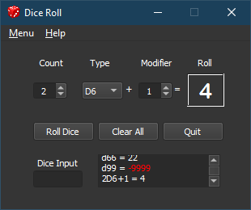

**PyQt5 Dice Roll App Tutorial Files for Python 3.11**
======================================================

**This PyQt5 Dice Roll App** is a Python 3.11 program for rolling various dice using PyQt5.

Some Things You Will Need
-------------------------

* **Python 3.11+**

   This code was written using Python 3.11.

* **PyQt5 5.15.9**

   PyQt5 is the framework used for displaying the Window GUI and buttons, etc.

* **Qt Designer**

   A tool for designing Windows GUIs based on the Qt framework for your Python programs. Windows and Mac versions are
   available at https://build-system.fman.io/qt-designer-download

Contact
-------
Questions? Please contact shawndriscoll@hotmail.com
